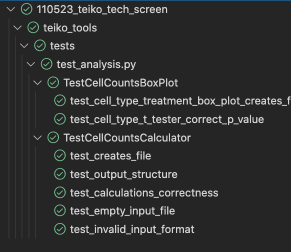
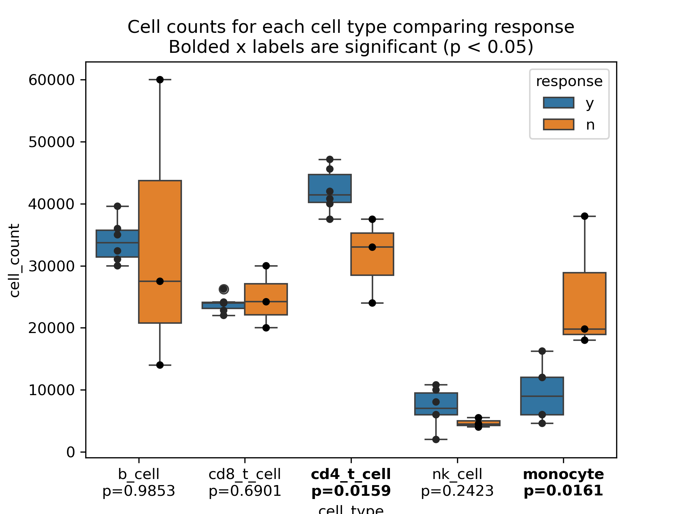

This is a project to accomplish the teiko.bio technical screen.
# Python

For this project i decided to use conda to manage the dependencies. I like to use conda since this env manager extends beyond python and can be used to manage R and other languages. I additonally used `conda-lock` to create a lock file for the dependencies. This is a great tool to ensure that the dependencies are reproducible across platforms.

To create the environment i used the command `make venv` which will create a conda environment called within this repo `.venv/` and installs the dependencies in `conda-lock.yml`. To activate the environment i used `conda activate .venv/`.

To run the code i used `make run` which will run the code in [`main.py`](./main.py). This script will run the code in [`problem1.ipynb`](./problem1.ipynb) and [`problem2.ipynb`](./problem2.ipynb). The code in these notebooks is also available in [`teiko_tools/analysis.py`](./teiko_tools/analysis.py). 

For both problems I performed a proof of concept in the notebooks and then moved the code into the [`teiko_tools/analysis.py`](./teiko_tools/analysis.py) file. I did this to ensure that the code was reproducible and could be run from the command line.

Tests were added for the python portion of the assessment. Unfortunately i did not have time to add CI/CD to this project. The tests can be run using `make test` and the results are shown below.




## Challenge Questions
1. Please write a python program to convert cell count in cell-count.csv to relative frequency (in percentage) of total cell count for each sample. Total cell count of each sample is the sum of cells in the five populations of that sample. Please return an output file in csv format with cell count and relative frequency of each population of each sample per line. The output file should have the following columns:

    sample: the sample id as in column sample in cell-count.csv
    total_count: total cell count of sample
    population: name of the immune cell population (e.g. b_cell, cd8_t_cell, etc.)
    count: cell count
    percentage: relative frequency in percentage

> The program is [`cell_counts_calculator`](./teiko_tools/analysis.py#L11) and the file produced is [`cell-counts-relative.csv`](./cell-counts-relative.csv). A proof of concept for this tool is here [`problem1.ipynb`](./problem1.ipynb).

2. Among patients who have treatment tr1, we are interested in comparing the differences in cell population relative frequencies of melanoma patients who respond (responders) to tr1 versus those who do not (non-responders), with the overarching aim of predicting response to treatment tr1. Response information can be found in column response, with value y for responding and value n for non-responding. Please only include PBMC (blood) samples. 
    * For each immune cell population, please generate a boxplot of the population relative frequencies comparing responders versus non-responders.
    * Which cell populations show a difference between responders and non-responders? Please include statistics to support your conclusion.

> I decided to combine both requirements into the boxplot figure. In the boxplot the x-tick labels were bolded if a T-test between the two groups was significant. The figure is [`treatment_comparison.png`](./treatment_comparison.png) and the proof of concept code is [`problem2.ipynb`](./problem2.ipynb).
> This code is located in [`CellCountsBoxPlot`](./teiko_tools/analysis.py#L61) where a class was used to hold both the plotting and the statistical test.  The plotting is done using `seaborn` and `matplotlib`. 




# Database

1. How would you design a database to capture the type of information and data in cell-count.csv? Imagine that you’d have hundreds of projects, thousands of samples and various types of analytics you’d want to perform, including the example analysis of responders versus non-responders comparisons above. Please provide a rough prototype schema.

> See [schema.sql](./schema.sql) which shows a relational database. In this design i included five tables, projects, and treatments to store unique projects and treatments, then there is a subjects table to store information about the subjects in the studies, samples table to track the samples collected from the subjects, and then cell_counts to track the cell counts collected per sample. Overall the realtional database lends itself to being extensible and the `SERIAL PRIMARY KEY` and `ON DELETE CASCADE` create a stable infrastructure with protections in place to ensure data is not duplicatied and the relations remain valid. 

2. What would be some advantages in capturing these information in a database?

> A database creates an incredible envrionment for development. One of the main advantages is the database server is available for multiple users to add and recieve data ansychronously.Also acquiring the data is increibly fast and specific. Instad of relying on csv's and subsetting or combinding those csv, queries can be constructed to specifically collect and return only the data needed.

3. Based on the schema you provide in (1), please write a query to summarize the number of subjects available for each condition.

> I took this as an opprotunity to learn postgresql. In all my experience i've not had an opprotunity to create and learn postgresql. I used conda to install postgresql using `make venv` from there i captured the commands in `main.sh` to stand up a database called `teiko_db`. From there I instantiated the tables in [`schema.sql`](./schema.sql) using a python function [`schema_standup`](teiko_tools/db_tools.py#L10). From there I loaded the data into the database using `pandas` with the function [`db_loader`](teiko_tools/db_tools.py#L49).

I was then able to execute the qeury to obain the result,
```
SELECT condition, COUNT(DISTINCT subject_id) AS number_of_subjects
FROM research_data.subjects
GROUP BY condition;
```
Which returned,

| Condition | Number of Subjects |
|-----------|--------------------|
| healthy   | 4                  |
| lung      | 3                  |
| melanoma  | 6                  |

4. Please write a query that returns all melanoma PBMC samples at baseline (time_from_treatment_start is 0) from patients who have treatment tr1.

 ```
SELECT subject_name, sample_name, age, sex
FROM research_data.samples as s
JOIN research_data.subjects as sub ON s.subject_id = sub.subject_id
JOIN research_data.treatments as t ON s.treatment_id = t.treatment_id
WHERE t.treatment_name = 'tr1' 
AND sub.condition = 'melanoma'
AND s.sample_type = 'PBMC' 
AND s.time_from_treatment_start = 0;
```

Returns

| subject_name | sample_name | age | sex | response | project_name |
|--------------|-------------|-----|-----|----------|--------------|
| sbj1         | s1          | 70  | F   | y        | prj1         |
| sbj3         | s5          | 75  | M   | n        | prj1         |
| sbj8         | s12         | 30  | F   | y        | prj2         |
| sbj9         | s13         | 72  | M   | y        | prj2         |
| sbj12        | s16         | 50  | F   | n        | prj3         |
| sbj13        | s17         | 50  | M   | y        | prj3         |


5. Please write queries to provide these following further breakdowns for the samples in (4): 

a. How many samples from each project 
```
SELECT p.project_name, COUNT(s.sample_name) AS sample_count
FROM research_data.samples as s
JOIN research_data.subjects as sub ON s.subject_id = sub.subject_id
JOIN research_data.projects as p ON sub.project_id = p.project_id
JOIN research_data.treatments as t ON s.treatment_id = t.treatment_id
WHERE t.treatment_name = 'tr1' 
AND sub.condition = 'melanoma'
AND s.sample_type = 'PBMC' 
AND s.time_from_treatment_start = 0
GROUP BY p.project_name;
```

| project_name | sample_count |
|--------------|--------------|
| prj1         | 2            |
| prj2         | 2            |
| prj3         | 2            |

    
b. How many responders/non-responders

```
SELECT response,COUNT(s.sample_name) AS sample_count
FROM research_data.samples as s
JOIN research_data.subjects as sub ON s.subject_id = sub.subject_id
JOIN research_data.projects as p ON sub.project_id = p.project_id
JOIN research_data.treatments as t ON s.treatment_id = t.treatment_id
WHERE t.treatment_name = 'tr1' 
AND sub.condition = 'melanoma'
AND s.sample_type = 'PBMC' 
AND s.time_from_treatment_start = 0
GROUP BY s.response;
```

| response | sample_count |
|----------|--------------|
| n        | 2            |
| y        | 4            |


c. How many males, females
```
SELECT sex,COUNT(sub.sex) AS sample_count
FROM research_data.samples as s
JOIN research_data.subjects as sub ON s.subject_id = sub.subject_id
JOIN research_data.projects as p ON sub.project_id = p.project_id
JOIN research_data.treatments as t ON s.treatment_id = t.treatment_id
WHERE t.treatment_name = 'tr1' 
AND sub.condition = 'melanoma'
AND s.sample_type = 'PBMC' 
AND s.time_from_treatment_start = 0
GROUP BY sub.sex;
```
| sex | sample_count |
|-----|--------------|
| F   | 3            |
| M   | 3            |
